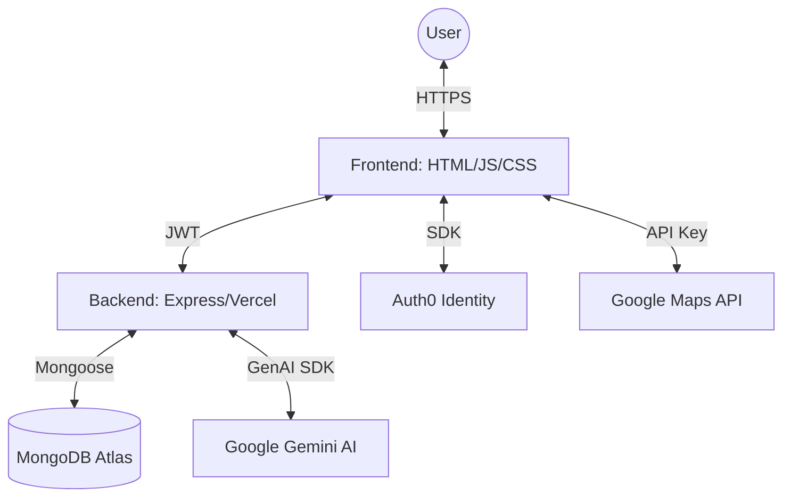

# GreenScore: Technical Documentation

GreenScore is a full-stack, AI-powered sustainability platform designed to help users track, analyze, and reduce their carbon footprint through intelligent habits and personalized insights.

## 🚀 Tech Stack

### Frontend
- **HTML5 & Vanilla JavaScript**: A high-performance, thin-client approach for maximum responsiveness.
- **Vanilla CSS3**: Custom-built design system with a premium, mobile-first aesthetic.
- **Auth0 SPA SDK**: Secure, multi-factor authentication for personalizing user data.
- **Lucide Icons**: Consistent, high-quality iconography across the entire UI.
- **Google Maps JS API**: Geocoding, static map previews, and intelligent transit routing.

### Backend
- **Node.js & Express**: Optimized for serverless execution on Vercel.
- **MongoDB Atlas**: Cloud-native NoSQL database for flexible activity logging and user metrics.
- **Mongoose**: ODM for structured data modeling and reliable database interactions.

### AI Engine (The "Brain")
- **Google Gemini 1.5/2.5 Flash**: Orchestrates all intelligent features:
    - **Adaptive AI Insights**: Habit-based analysis of user logs to provide actionable 7-word fragments.
    - **Receipt Vision**: Optical character recognition (OCR) and carbon value estimation from shopping receipts.
    - **Visual Car Matching**: Computer vision for identifying vehicles and matching them to the user's "Garage".

---

## 🎨 Feature Implementation Details

### 1. Adaptive AI Insights
**How it works:**
The platform analyzes the last 50 activities in the user's log. It identifies patterns (e.g., "high beef consumption" or "rush hour car trips") and sends a habit summary to the Gemini API. The AI then generates 3 ultra-concise fragments (max 7 words) providing supporting facts or alternatives. These insights are cached for 5 minutes during active sessions to ensure performance.

### 2. Nature's Debt Invoice (Live Stats)
**How it works:**
Located in the Statistics tab, this feature converts the user's lifetime `currentEmissions` (kg CO2e) into a printable-style invoice. It calculates the number of trees "due" for offset (at a rate of ~21kg/year absorption per tree) and identifies the earliest recorded log to show how long the debt has been outstanding.

### 3. Local Exposure (Pictorial Gauge)
**How it works:**
The Impact tab features a 4-state visual gauge. It calculates the ratio of the user's daily footprint against their personalized budget (default 47kg). The UI dynamically toggles between **HEALTHY**, **MODERATE**, **STRESSED**, and **CRITICAL** states, each with unique iconography and color themes.

### 4. Electricity Sync
**How it works:**
Users set up a one-time "Home Energy" profile. Based on household size and solar presence, a daily baseline kg CO2e is established. Every time the user logs in, the backend "syncs" any missed days since the last visit, automatically adding the home energy footprint to their daily totals.

### 5. Multi-Modal Logger
**How it works:**
- **Manual Log:** Direct input for pre-calculated values.
- **Food Scanner:** Uses Gemini Pro Vision to identify dishes and estimate their carbon intensity from a single photo.
- **Car identified Scanner:** Identifies car make/model from a photo and matches it against the user's saved "Garage" for precise per-trip carbon values.

---

## 🏗️ Architecture

## 🔐 Environment Variables

Key variables required for the platform to function:
- `MONGO_URI`: Connection string for MongoDB Atlas.
- `GOOGLE_API_KEY`: API key for Gemini 1.5/2.5 Pro & Flash.
- `AUTH0_DOMAIN`: Your Auth0 domain.
- `AUTH0_AUDIENCE`: The API identifier for backend JWT validation.

---

## 🛠️ Running Locally

1. **Clone the repo.**
2. **Install dependencies:** `npm install`
3. **Set up .env:** Create a `.env` file in the root using `.env.example`.
4. **Run the dev server:** `npm start` (or `node api/index.js` for the backend).
5. **Open browser:** `http://localhost:3000`
